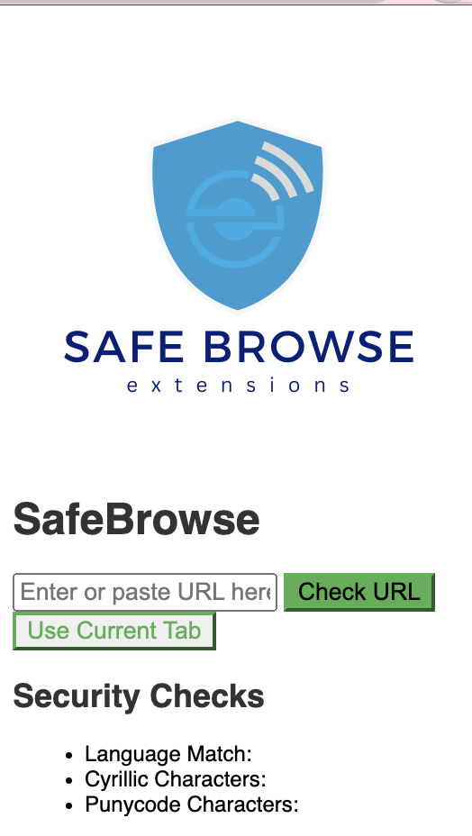

<!-- Centered logo -->

  

# Protect Yourself From Spoof Websites: Check URL Characters

This extension helps you stay safe online by checking your URLs for suspicious characters that could be used in website spoofing attempts.

## How it Works:

1. **Enter a URL or Check the Current Tab:** You can either paste a URL you want to check or click the button to analyze the current active tab's URL.
2. **Identify Lookalike Characters:** The extension scans the URL for characters that resemble legitimate letters but are actually from different alphabets (e.g., Cyrillic). Hackers sometimes use these characters to trick you into visiting a fake website that looks real.
3. **Detect Punycode:** The extension can also detect Punycode, a method used to represent non-Latin characters in URLs. While Punycode is legitimate, it can be misused to hide malicious website addresses.
4. **See the Results:** The extension displays clear information about whether the URL contains suspicious characters or Punycode.

## Stay vigilant and browse with confidence!

### Features:

- **Easy to use:** Simply enter a URL or click a button.
- **No modifications:** The extension doesn't modify your data; it provides information for you to make informed decisions.
- **Supports user-entered URLs and active tab checking.**

## How to Install:

1. Download the extension file (replace with download instructions).
2. Go to your Chrome extensions settings ([chrome://extensions/](chrome://extensions/)).
3. Enable "Developer mode" in the top right corner.
4. Drag and drop the downloaded extension file into the extensions page.

## Disclaimer:

This extension is a tool to help identify potential spoofing attempts. It's recommended to combine it with other security practices like checking website certificates and user reviews.

## UI Screenshot

*Screenshot of the extension's user interface*
